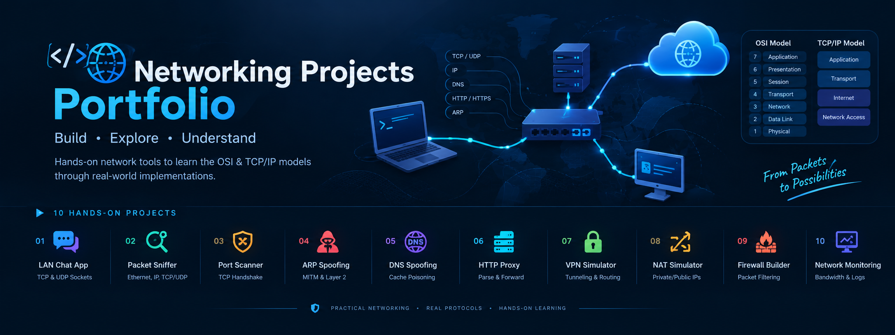

<div align="center">
  

  <h1>🌐 Networking Projects Portfolio</h1>

  <p>
    <strong>A hands-on collection of projects to master Computer Networking from Layer 1 to Layer 7.</strong>
  </p>

  <p>
    
    
    
    
    
  </p>
</div>

<br />

## 📖 Overview

This repository contains **hands-on projects** designed to help you master **Computer Networking** by building real tools. Instead of just reading about protocols, you will implement them to understand how everything works at a fundamental level—from raw Ethernet frames to DNS queries.

---

## 🎯 Learning Objectives

- 🧠 **Master Networking Models**: Internalize the OSI & TCP/IP models through practical implementation.
- 📦 **Understand Packet Flow**: See exactly how packets move, from Layer 2 up to Layer 7.
- 🛠️ **Build Real Tools**: Get comfortable with socket programming, protocol parsing, and traffic analysis.
- 🛡️ **Cybersecurity Fundamentals**: Apply core networking concepts essential for ethical hacking, DevOps, and cloud infrastructure.

---

## 🧭 Project Roadmap

Here is the structured journey through the world of networking:

| #  | Project Name | Key Concepts Covered |
|:--:|:-------------|:---------------------|
| **01** | **[LAN Chat App](./1.%20LAN%20Chat%20App)** | TCP, UDP, Socket Programming |
| **02** | **[Packet Sniffer](./2.%20Packet%20Sniffer)** | Ethernet Frames, IP, TCP/UDP headers |
| **03** | **[Port Scanner](./3.%20Port%20Scanner)** | TCP Handshake, Banner Grabbing |
| **04** | **[ARP Spoofing](./4.%20APR%20Spoofing)** | ARP Protocol, MITM, Layer 2 Networking |
| **05** | **[DNS Spoofing](./5.%20DNS%20Spoofing)** | DNS, Cache Poisoning, DNS Queries |
| **06** | **[Simple HTTP Proxy](./6.%20Simple%20HTTP%20Proxy)** | HTTP Parsing, Forwarding Requests |
| **07** | **[VPN Simulator](./7.%20VPN%20Simulator)** | Tunneling, Encryption, Routing Tables |
| **08** | **[NAT Simulator](./8.%20NAT%20Simulator)** | Private/Public IPs, Translation Tables |
| **09** | **[Firewall Builder](./9.%20Firewall%20Builder)** | Packet Filtering, Rules, Port Blocking |
| **10** | **[Network Monitoring Tool](./10.%20Network%20Monitoring%20Tool)** | Traffic Logging, Bandwidth Analysis |

---

## 📈 Why This Portfolio Matters

Understanding networking is foundational for modern tech roles. These projects simulate real-world scenarios—from reconnaissance and packet inspection to traffic manipulation. It offers a practical way to bridge the gap between theoretical textbooks and the real-world skills needed by professionals.

This repository serves both as a learning toolkit and a demonstration of applied networking fundamentals.

---

## 🐳 Running with Docker (Web Desktop)

Since many of these projects use graphical interfaces (Tkinter), this repository includes a **Docker Web Desktop** environment. This allows you to run all tools safely within a contained virtual desktop via your web browser.

### Prerequisites
- [Docker](https://www.docker.com/) and [Docker Compose](https://docs.docker.com/compose/)

### Quick Start

1. Start the container in the background:
   ```bash
   docker-compose up -d
   ```
2. Open your web browser and navigate to:
   **[http://localhost:6080](http://localhost:6080)**
3. You will see a full Linux desktop interface! Open the `LXTerminal` from the start menu.
4. Navigate to the project directory:
   ```bash
   cd /root/Networking-Projects
   ```
5. Run any tool using Python 3. For example:
   ```bash
   python3 "10. Network Monitoring Tool/realtime_monitor.py"
   ```

To stop the container, run:
```bash
docker-compose down
```

---

## ⚠️ Disclaimer

All tools, techniques, and code presented in this repository are intended strictly for **educational and authorized use**. Do not attempt to apply these tools or methods on live networks or systems without **explicit, written permission**.

---

## Built by AAKASH
